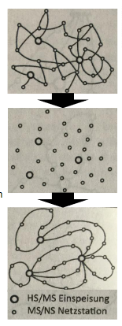

# Welchee Herausforderung hat die Netzplanung
- Wachsender Zubau an REA
- Strukturelle Einbindung
- bedarfsgerechte Versorgung der Stromkunden
- integration von erneuerbaren Energien(Projektdruck und wenig Absprache)

# Was sind die Mussziele bei der Netzplanung ?
- Übertragungsfähigkeit
- Kurzschlussstrombeanspruchung
- Versorgungszuverlässigkeit
- Netzbetriebsführung
- Planungsziele: Sicherheit, Wirtschaftlichkeit und Umweltverträglichkeit

# Wann ist ein Netzausbau überhaupt nötig?
1. Betriebsmittelüberlastung
2. Spannungskriterium (2% / 3%)
3. Nennspannungsprüfung (±10 %)

# Welche Gründe gibt es für eine Netzplanung ?
- Netz Ausbau
  - Änderung oder Erweiterung des Versorgungsgebietes, Anlagenersatz und Netzertüchtigung
  - Lastveränderung durch Zubau/Abbau
  - Ausbau von Regenerative Energie Anlagen
- Netz Qualität
  - Erhöhung der Versorgungszuverlässigkeit 
  - Minimierung der Netzverluste
  - Ausgestaltung von Smart Grids

# Welche 5 Planungsschritte werden in welcher Reihenfolge bei einer Planung durchgeführt?
 Information -> Modellierung -> Analyse -> Planungsarbeit -> Dokumentation
 
# Was ist das Problem der operativen Planungsmethode ?
- Komplizierte strukturierung
- Betriebsmittel sind schwieriger zu handhaben
- Fehlerbehebung ist schwierig
- Versorgungssicherheit sinkt

# Wie ist das vorgehen der strategischen Planungsmethodik ?
- Mittel-und langfristig mit bewussten Eingriffen in das Netz als Gesamtsystem zur Erhaltung oder Wiederherstellung der Standardnetzform

# Was ist das Ziel der Greenfield-Planung ?
- Ziel ist es ein komplexes durch operativen Ausbau geprägtes Netz in ein optimal strukturiertes Netz zu überführen. 

# Was sind die Schritte bei der erstellung einer Greenfield-Planung ?
1. Erstellung des aktuellen Netzplanes
2. Ausblenden der Verbindungsleitungen
3. Erstellung des Ziel-Netzes
  - Erarbeiten von verschiedenen Varianten
  - Bewertung der Variante und optimale Zielnetz auswahl.
 

# Wie werden Betriebsmittel im Zuge der Informations Aufbereitung der Planung von Netzen geschätzt ?
Bei einigen Betriebsmitteln müssen wahrscheinlich Daten geschätzt werden. Dabei ist zu beachten, dass diese niemals unterschätzt werden sollten, aber auch nicht maßlos überschätzt.

# Was versteht man bei CAPEX und OPEX ?
- CAPEX := Investitionsausgaben eines Unternehmens
- OPEX  := Ausgaben zur Gewährleistung des Unternehmensbetriebs

